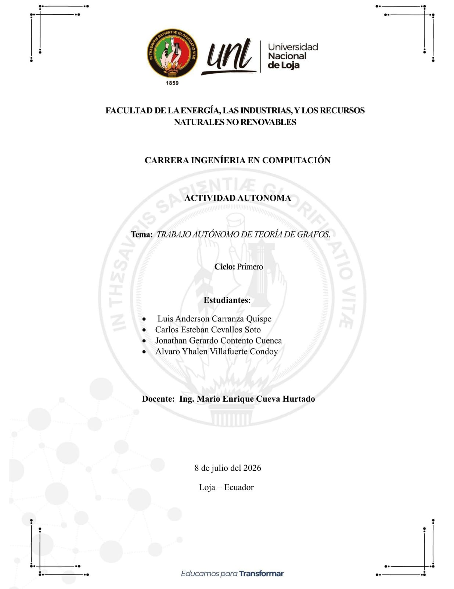
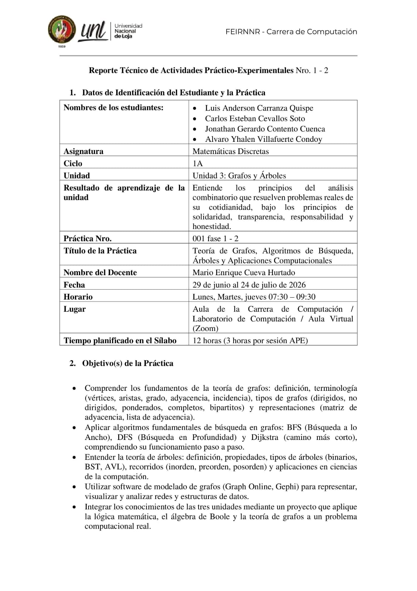
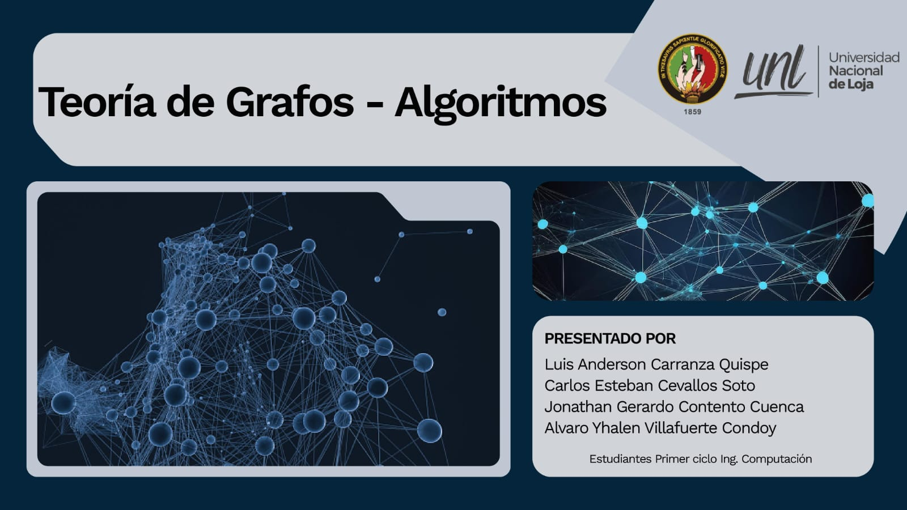
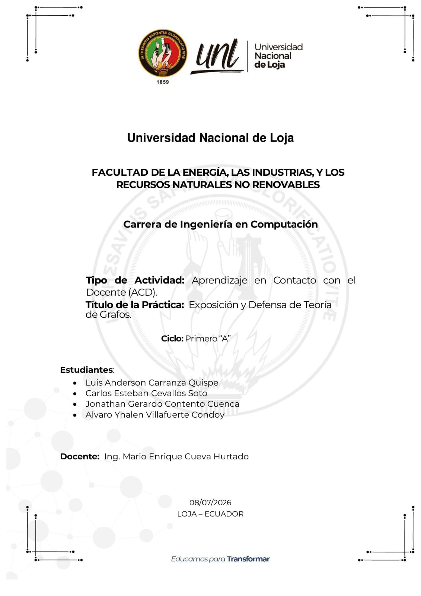

  
<b>FACULTAD DE LA ENERGÍA, LAS INDUSTRIAS Y 
LOS RECURSOS NATURALES NO RENOVABLES 

--- 

---

#  COMPUTACIÓN

---

## Matemáticas Discretas

  

### Primer Ciclo:

2026

  

**Docente:** Ing. Mario Enrique Cueva Hurtado

 

**Estudiante:** Jonathan Contento

   

**Loja-Ecuador-2026**

---
                                                    
# Portafolio de Matemáticas Discretas

##### 📄 Aprendizaje Autónomo

Haz clic en la imagen para abrir el documento.

---

##### 📄 Aprendizaje Practico Experimental (APE)

Haz clic en la imagen para abrir el documento.

---

##### 📄 Presentación

Haz clic en la imagen para abrir el documento.

---

##### 📄 Enlace Video Presentacion ACD

Haz clic en la imagen para abrir el documento.

